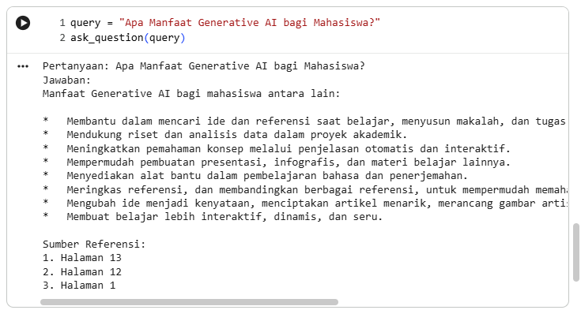

# 🤖 Build a Private & Local RAG System: Llama-3.2 on Tesla T4

**Project Case Study: Generative AI Knowledge Base**

## 📌 Pendahuluan

Proyek ini adalah implementasi sistem **Retrieval-Augmented Generation (RAG)** tingkat lanjut yang dijalankan sepenuhnya di lingkungan lokal (Google Colab GPU T4). Berbeda dengan sistem AI publik, proyek ini memprioritaskan privasi data dan akurasi tinggi dengan membatasi "otak" AI hanya pada dokumen referensi yang diberikan.

## 🌟 Mengapa Proyek Ini Penting?

Dalam transisi karier saya ke bidang Data Science, saya membangun sistem ini untuk menjawab tantangan utama LLM: **Halusinasi**. Dengan RAG, model tidak lagi "menebak" jawaban, melainkan "mencari" data nyata terlebih dahulu sebelum berbicara.

## 🏗️ Arsitektur & Komponen Teknis

### 1. Model & Optimization

- **LLM:** `unsloth/Llama-3.2-3B-Instruct`. Mengapa Unsloth? Karena model ini telah dioptimalkan secara manual untuk berjalan 2x lebih cepat dan menggunakan memori 70% lebih sedikit.
- **Quantization (4-bit NF4):** Menggunakan teknik `BitsAndBytes` untuk memadatkan parameter model sehingga model 3B yang kompleks dapat beroperasi dengan sangat ringan di VRAM 16GB.

### 2. Retrieval Strategy (The MMR Advantage)

Alih-alih menggunakan _Similarity Search_ biasa yang cenderung redundan, saya mengimplementasikan **Maximal Marginal Relevance (MMR)**:

- **K-Selection:** Sistem mengambil 10 kandidat dokumen paling relevan.
- **Diversity Re-ranking:** Dari 10 kandidat, sistem menyaring kembali untuk memilih 3 dokumen yang isinya paling berbeda satu sama lain (diverse).
- **Hasil:** Jawaban yang dihasilkan jauh lebih kaya karena mencakup berbagai perspektif halaman, bukan hanya pengulangan satu poin yang sama.

### 3. Orchestration & Pipeline

Dibangun menggunakan **LangChain Expression Language (LCEL)** untuk memastikan aliran data yang _seamless_ antara:

- **PyPDFLoader:** Menangani parsing dokumen PDF secara akurat.
- **BGE-M3 Embeddings:** Model embedding mutakhir yang mendukung pencarian multibahasa dan teks panjang.
- **ChromaDB:** Sebagai gudang vektor (Vector Store) untuk penyimpanan index yang cepat.

## 🛠️ Langkah Implementasi (Step-by-Step)

### A. Pengaturan Lingkungan

Mengonfigurasi `bnb_config` dengan presisi `bfloat16` untuk menjaga keseimbangan antara kecepatan komputasi dan akurasi jawaban di GPU T4.

### B. Pembuatan Prompt Template Khusus

Menggunakan format instruksi Llama-3 (`<|start_header_id|>system<|end_header_id|>`) untuk memberikan perintah yang sangat ketat:

> _"Jika jawaban tidak ditemukan dalam konteks, sampaikan dengan jujur bahwa Anda tidak mengetahui jawabannya."_

### C. Menjahit Rangkaian (Chain)

Menggunakan operator `|` untuk menghubungkan `retriever`, `prompt`, `llm`, dan `output_parser` dalam satu jalur eksekusi tunggal.

## 📊 Analisis Output & Validasi

Sistem diuji dengan pertanyaan: _"Apa manfaat Generative AI bagi mahasiswa?"_

**Analisis Jawaban:**

- Sistem berhasil melakukan **sintesis informasi** dari Halaman 1 (pendahuluan), Halaman 12 (aspek teknis), dan Halaman 13 (aspek praktis).
- **Verifikasi Referensi:** Output secara eksplisit mencantumkan nomor halaman sumber, sehingga pengguna dapat melakukan _cross-check_ langsung ke dokumen asli.

## 🚀 Kesimpulan & Pengembangan Kedepan

Proyek ini membuktikan bahwa sistem AI yang kuat tidak harus mahal. Dengan teknik kuantisasi dan strategi retrieval yang tepat, kita bisa membangun asisten AI yang cerdas, privat, dan akurat di infrastruktur gratis/murah.

---

### 👨‍💻 Tentang Penulis

**Arief Wicaksono** _Mechanical Engineering Graduate (Universitas Darma Persada) | Data Science Student (Universitas Terbuka)_ Berfokus pada transisi karier ke bidang AI & Machine Learning dengan spesialisasi pada Cloud Computing (AWS Certified) dan Generative AI.
